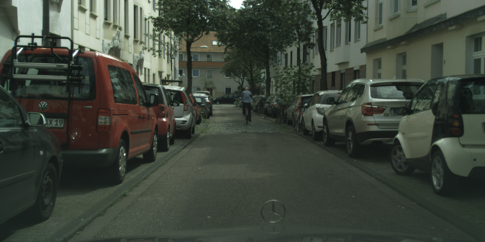
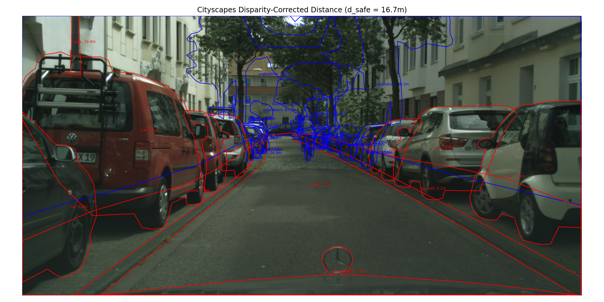
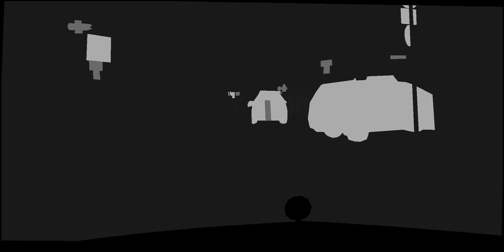
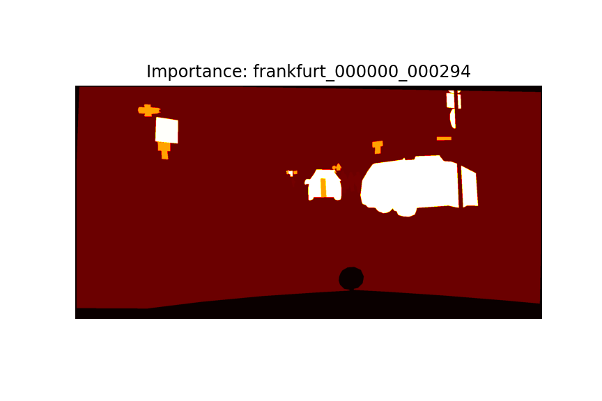
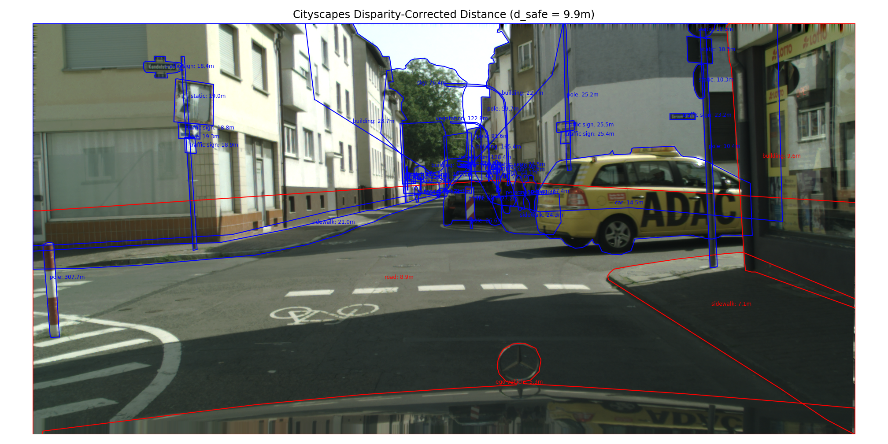
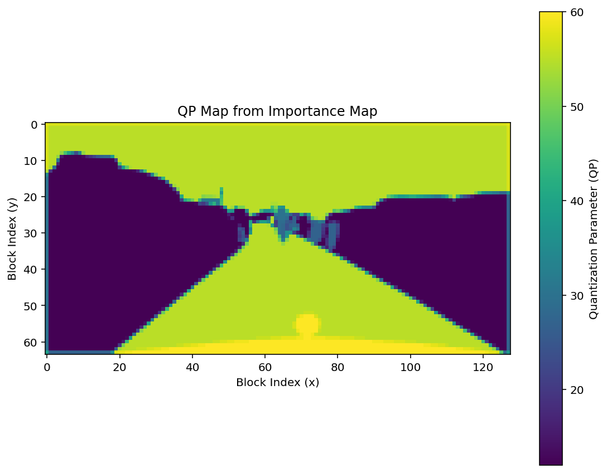

# Cityscapes Importance Label Generator

이 프로젝트는 Cityscapes 데이터셋에서 주어진 **disparity 맵**, **semantic segmentation label**,  
그리고 **ego-vehicle speed**, **camera calibration 정보**를 바탕으로  
**픽셀 단위의 중요도 맵 (importance map)** 을 생성합니다.

중요도 맵은 0~1 사이의 soft label 값을 갖습니다.  
가까운 차량·보행자와 같은 중요 객체는 1.0에 가까운 값을,  
멀리 있는 배경이나 무시 가능한 객체는 0.0에 가까운 값을 부여받습니다.

---

## 📥 입력 데이터 구조

```
cityscapes_trainval/
├── gtFine/val/<city>/_gtFine_labelIds.png # semantic 라벨 ID 이미지
├── disparity/val/<city>/_disparity.png # stereo disparity (16-bit PNG)
├── vehicle/val/<city>/_vehicle.json # 차량 속도 정보 ("speed" 키 사용)
├── camera/val/<city>/_camera.json # fx, baseline 등 camera 보정 파라미터
├── gtFine/val/<city>/*_gtFine_polygons.json # 객체 위치 polygon (시각화용)
```

---

## ⚙️ 처리 과정 요약

1. **속도 & 카메라 파라미터 로딩**

   * `vehicle.json` → speed
   * `camera.json` → `fx`, `baseline`
   * 안전 거리 계산:

```text
d_safe = v * t_react + v^2 / (2 * a)
기본값: t_react = 2.5 sec, a = 3.4 m/s²
```

2. **Disparity → 거리 변환**

```
distance = (fx * baseline) / disparity
```

3. **클래스 중요도 설정**

* 고정 중요도 클래스 (`road`, `building`, ...): 0.1 부여
* 동적 객체 (`car`, `person`, `bicycle`, ...): 거리 기반 감쇠 함수 적용

```
중요도 함수 I(d):

    I(d) = 1.0                            if d <= d_safe
           exp(-β * (d - d_safe))        if d > d_safe

    where β = ln(2) / d_safe    # 거리 2배가 되면 중요도 반감
```

4. **중요도 맵 저장**

* `.npy`: 중요도 값 (float32)
* `.png`: 정규화된 grayscale
* `_vis.png`: 컬러맵 시각화
* `_distance_annotation.png`: 거리 주석 + 안전거리 색상 시각화

---

## 📤 출력 예시

| 파일명                         | 설명                         |
| --------------------------- | -------------------------- |
| `*_importance.npy`          | 픽셀별 중요도 float32 배열         |
| `*_importance.png`          | 정규화 grayscale 이미지 (0\~255) |
| `*_importance_vis.png`      | 컬러맵 시각화 (hot colormap)     |
| `*_distance_annotation.png` | 각 객체의 거리 + 색상 주석 시각화       |

---

## 🏃 실행 예시

```python
label_root = "cityscapes_trainval/gtFine/val"
disparity_root = "cityscapes_trainval/disparity/val"
vehicle_root = "cityscapes_trainval/vehicle/val"
camera_root = "cityscapes_trainval/camera/val"
output_root = "cityscapes_trainval/importance_map/val"

selected_cities = ["frankfurt", "lindau", "munster"]

for city in selected_cities:
    batch_generate_importance_maps_auto_speed_with_progress(
        label_root, disparity_root, vehicle_root, output_root,
        selected_cities=city,
        visualize_every=30
    )
```

---

## 📤 출력 예시 및 시각화
이 프로젝트는 각 프레임에 대해 다음과 같은 시각화 파일을 생성합니다:

항목	설명
*_importance.npy	float32 배열, 픽셀 단위 중요도 (0.0~1.0)
*_importance.png	정규화된 grayscale 중요도 이미지
*_importance_vis.png	컬러맵 기반 중요도 시각화 (hot colormap)
*_distance_annotation.png	객체별 거리 및 안전거리 주석 시각화 (Red/Blue 폴리곤)

---

🖼️ 시각화 예시
🟦 안전거리 바깥 → 낮은 중요도
🟥 안전거리 안쪽 → 높은 중요도

cologne_000090_000019
| 항목              | 이미지                                                                 |
| --------------- | ------------------------------------------------------------------- |
| 원본 이미지          |         |
| 중요도 (grayscale) |           |
| 중요도 (컬러맵)       |  |
| 거리 + 주석 시각화     |    |

frankfurt_000000_000294
| 항목              | 이미지                                                                   |
| --------------- | --------------------------------------------------------------------- |
| 원본 이미지          |         |
| 중요도 (grayscale) |           |
| 중요도 (컬러맵)       |  |
| 거리 + 주석 시각화     |    |

---

## 📚 참고

* [Cityscapes Dataset](https://www.cityscapes-dataset.com/)
* [Camera Calibration 공식 문서 (PDF)](https://github.com/mcordts/cityscapesScripts/blob/master/docs/csCalibration.pdf)
* Disparity 변환 공식: `(p - 1) / 256.0` (p는 uint16 픽셀 값)

---

## 📊 QP 맵 생성기 (QP Map Generator)

이 모듈은 생성된 **중요도 맵 (`*.npy`)을 기반으로**, **비디오 인코딩을 위한 QP (Quantization Parameter) 맵을 생성**합니다.  
HEVC/H.264 기반 압축에서 객체 인식 성능을 유지하면서 **중요 영역에 더 많은 비트를 할당하기 위한 사전처리 과정**입니다.

---

### ⚙️ 처리 방식 요약

1. `importance_map.npy` 파일 로딩 (float32, 0.0~1.0)
2. 블록 단위(`block_size`)로 평균 중요도 계산
3. 중요도가 높을수록 낮은 QP 부여 (화질 유지)
4. 전체 QP 분포는 다음 범위로 설정:

```
QP ∈ [base_qp - delta, base_qp + delta]
예: base_qp = 32, delta = 3 → [29, 35]
```

5. 결과는 CSV 및 시각화 이미지로 저장

---

### 🧪 사용 예시

```python
from qp_map_generator import generate_qp_map_csv

generate_qp_map_csv(
    importance_map_path='output/cologne_000090_000019_importance.npy',
    output_csv_path='output/cologne_000090_000019_qp_map.csv',
    block_size=16,
    base_qp=32,
    delta=3
)
```

---

### 🖼️ 시각화 예시

- QP 맵은 `viridis` colormap으로 표시됨
- QP 값이 낮을수록 (화질 높음) → **파란색**
- QP 값이 높을수록 (압축률 높음) → **노란색**

| 항목              | 이미지 예시                                          |
| ----------------- | --------------------------------------------------- |
| QP 맵 컬러 시각화    |  |

---

### 📤 출력 파일 예시

| 파일명                            | 설명                                       |
| --------------------------------- | ------------------------------------------ |
| `*_qp_map.csv`                    | 블록 단위 QP 값을 저장한 CSV 파일               |
| `*_qp_map_vis.png` (선택적)       | 시각화용 컬러맵 이미지                         |

---

### ⚠️ 주의사항

- 입력 `.npy` 파일의 크기는 원본 이미지 해상도와 일치해야 하며, `block_size`는 이를 정수로 나눌 수 있어야 합니다.
- `delta` 값을 조정하면 QP 분포 폭을 더 넓게 할 수 있습니다.
- `gamma` 조절 등을 통해 중요도 분포 강조(비선형 스케일링)도 가능합니다.

---

### 🔗 활용 예

- 중요 영역 우선 압축 → FFmpeg `--zones`로 연동 가능
- Cityscapes 압축 실험, detection-aware encoding 등에 응용 가능

---

## 🎯 활용 가능성

* 중요도 기반 비디오 압축 (중요 영역 고품질 유지)
* 중요도 기반 가중 손실 학습 (e.g., detection, segmentation)
* 중요 영역 ROI 지정 및 후처리 우선순위 설정

---

